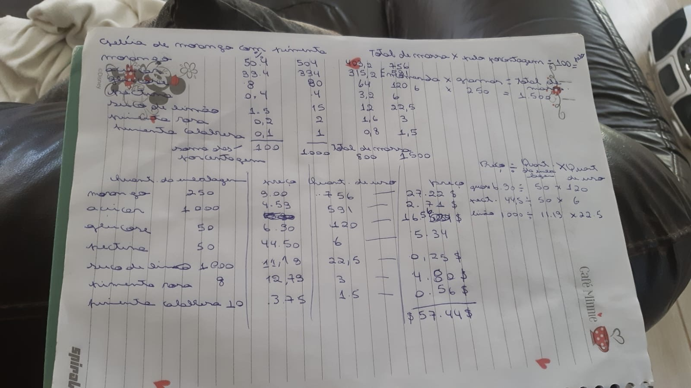
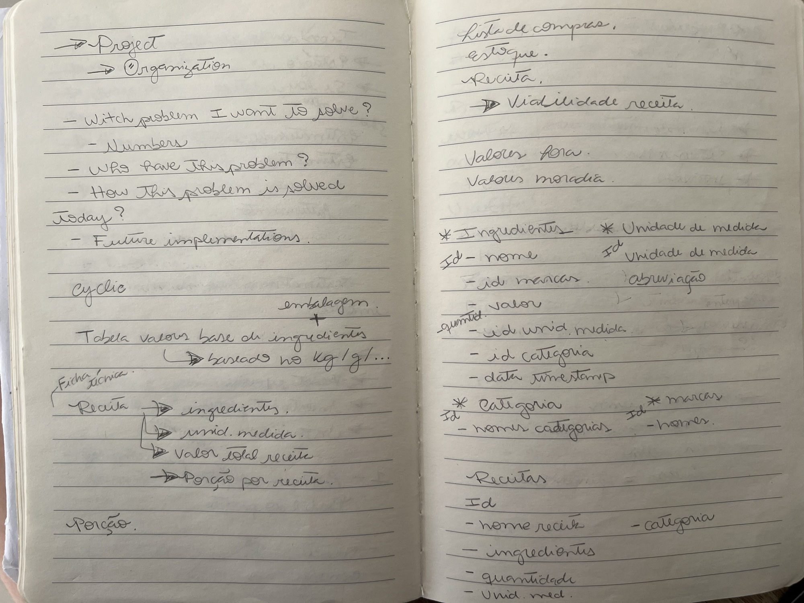
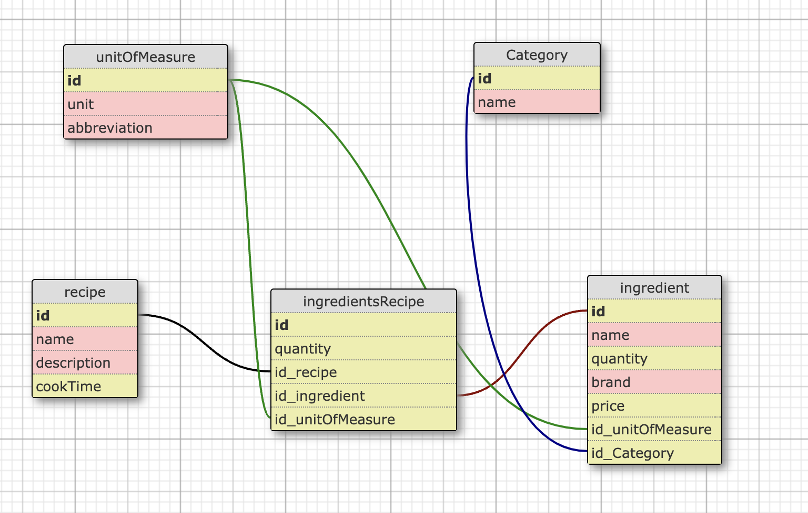
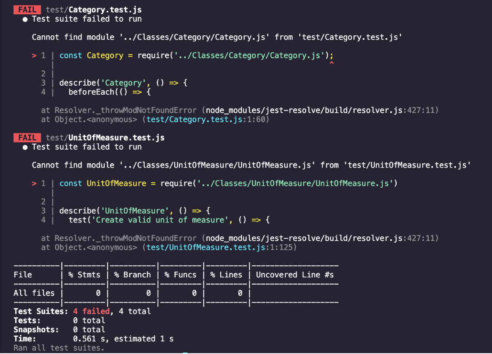
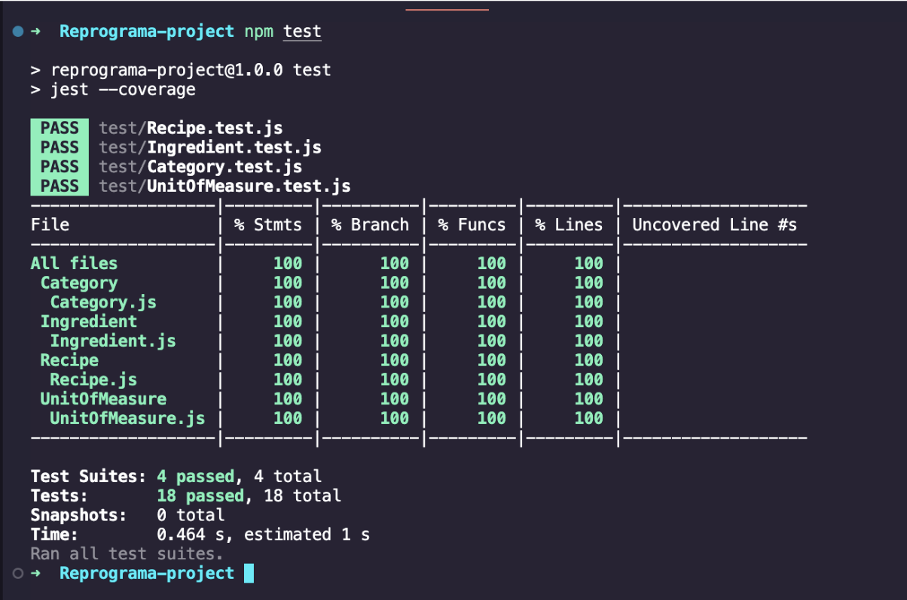
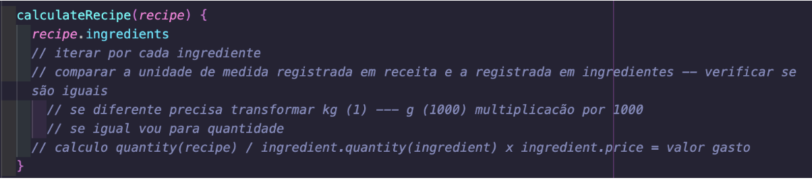
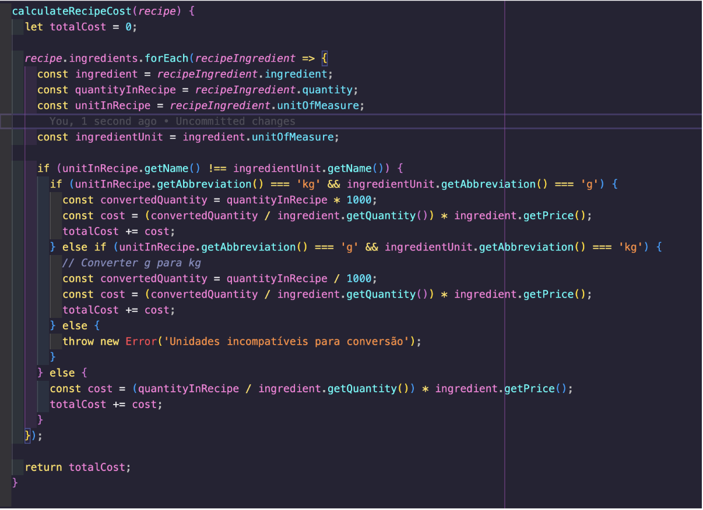
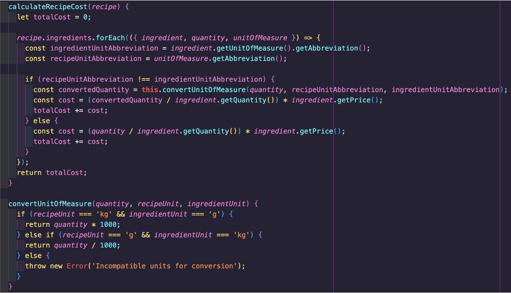

# BakeSmart

## Descrição

BakeSmart é uma aplicação projetada para resolver os desafios enfrentados por pequenos empreendedores culinários e entusiastas de culinária na gestão de custos de produção de receitas. Este projeto visa ajudar na definição de preços de venda e maximização dos lucros.

## Problema

Muitos pequenos produtores de doces e salgados encontram dificuldades para calcular os custos de produção de suas receitas, o que afeta diretamente os preços de venda e os lucros. Métodos manuais, excel ou softwares complexos e caros são as opções mais comuns atualmente, tornando o processo trabalhoso e pouco acessível.

## Solução

O BakeSmart resolve este problema oferecendo aos usuários uma plataforma para inserir ingredientes, custos, categorias e unidades de medida. Com esses dados, a aplicação realiza o cálculo automático do custo total de uma receita, simplificando o processo e proporcionando uma gestão mais eficiente.

## Funcionalidades

- Cadastro de ingredientes com custos unitários e unidades de medida.
- Criação de receitas com ingredientes, quantidades e medidas.
- Cálculo dos custos de produção por receita.

## Funcionalidades Futuras

- Sugestão de preço de venda baseada nos custos e margem de lucro desejada.
- Gestão de estoque.
- Programação de receitas de acordo com calendário.
- Relatórios visuais para exibir custos e lucros de cada receita.

## Classes

- **Ingredient**
    - Lista estática de ingredientes
    - Construtor
    - Métodos para manipulação de dados

- **Recipe**
    - Construtor
    - Métodos para adicionar ingredientes, calcular custos e conversão de unidades

- **Category**
    - Lista estática de categorias
    - Construtor
    - Método para busca de categorias

- **Unit Of Measure**
    - Lista estática de unidades de medida
    - Construtor
    - Método para obtenção de abreviação

## Implementação

## Construção do Projeto

Projeto iniciado com TDD:

----

Construção de métodos complexos:

-----

-----

## Construção Web Aplicação
[Veja o repositório do BakeSmart no GitHub](https://github.com/kauanatomb/bakeSmart)
